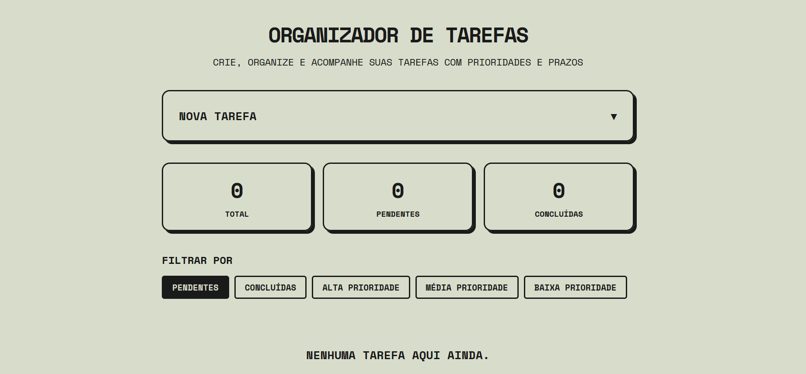
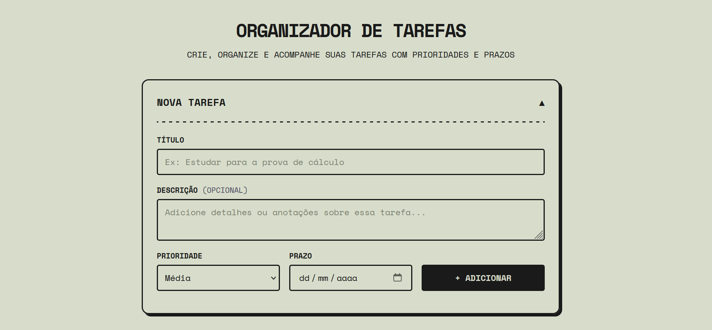
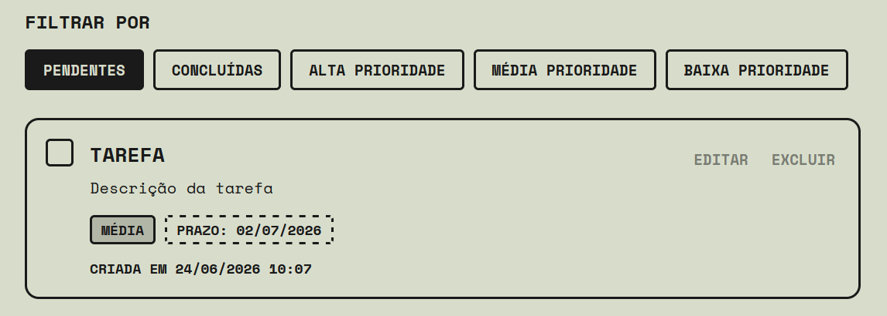

# Prioriza

Aplicação full-stack para gerenciamento de tarefas com suporte a prioridades, prazos e filtros dinâmicos. O backend expõe uma API RESTful construída com FastAPI, e o frontend é servido diretamente pelo servidor como arquivos estáticos, sem dependência de frameworks externos.

---

## Funcionalidades

- Criação, edição, conclusão e exclusão de tarefas
- Classificação por nível de prioridade: Alta, Média ou Baixa
- Definição de prazo com identificação visual de tarefas vencidas
- Filtros por status (Pendentes, Concluídas) e por nível de prioridade
- Painel de métricas com contagem de tarefas totais, pendentes e concluídas
- Ordenação automática por prioridade dentro de cada filtro
- Feedback visual via notificações (toast) e modais de confirmação

---

## Preview

**Painel principal**



**Formulário de nova tarefa**



**Card de tarefa com prioridade e prazo**



---

## Tecnologias

### Backend

| Tecnologia | Versão mínima | Função |
|---|---|---|
| Python | 3.12+ | Linguagem principal |
| FastAPI | 0.110.0 | Framework web e documentação automática da API |
| SQLAlchemy | 2.0.0 | ORM para comunicação com o banco de dados |
| Pydantic | 2.0.0 | Validação de dados e serialização dos schemas |
| SQLite | — | Banco de dados relacional em arquivo local |
| Uvicorn | 0.27.0 | Servidor ASGI |
| python-dotenv | 1.0.0 | Carregamento de variáveis de ambiente |

### Frontend

| Tecnologia | Função |
|---|---|
| HTML5 | Estrutura semântica da interface |
| CSS3 | Estilização e responsividade (sem frameworks) |
| JavaScript ES6+ | Manipulação do DOM e consumo da API via Fetch |

---

## Estrutura do Projeto

```
prioriza/
├── app/
│   ├── routes/
│   │   └── tasks.py       # Endpoints da API
│   ├── static/
│   │   ├── index.html     # Interface do usuário
│   │   ├── script.js      # Lógica do cliente
│   │   └── style.css      # Estilos
│   ├── database.py        # Conexão e sessão com o banco de dados
│   ├── main.py            # Ponto de entrada da aplicação
│   ├── models.py          # Modelos SQLAlchemy (tabelas)
│   └── schemas.py         # Schemas Pydantic (validação)
├── .env                   # Variáveis de ambiente (não versionado)
├── .gitignore
├── requirements.txt
└── README.md
```

---

## Como Executar Localmente

### Pré-requisitos

- Python 3.12 ou superior
- `pip` atualizado

### Passo a passo

**1. Clone o repositório**

```bash
git clone https://github.com/claraborim/prioriza.git
cd prioriza
```

**2. Crie e ative o ambiente virtual**

No Windows:
```bash
python -m venv venv
venv\Scripts\activate
```

No Linux/macOS:
```bash
python3 -m venv venv
source venv/bin/activate
```

**3. Instale as dependências**

```bash
pip install -r requirements.txt
```

**4. Configure as variáveis de ambiente**

Crie um arquivo `.env` na raiz do projeto com o seguinte conteúdo:

```env
DATABASE_URL=sqlite:///./tasks.db
```

Por padrão, a aplicação utiliza SQLite com o arquivo `tasks.db` gerado automaticamente na raiz. Para usar outro banco de dados compatível com SQLAlchemy, basta alterar essa variável.

**5. Inicie o servidor**

```bash
uvicorn app.main:app --reload
```

**6. Acesse a aplicação**

- Interface: [http://127.0.0.1:8000](http://127.0.0.1:8000)
- Documentação interativa (Swagger UI): [http://127.0.0.1:8000/docs](http://127.0.0.1:8000/docs)

---

## API

Todos os endpoints estão registrados sob o prefixo `/tarefas`.

| Método | Rota | Descrição |
|---|---|---|
| `GET` | `/tarefas/` | Lista todas as tarefas. Aceita `skip` e `limit` para paginação |
| `POST` | `/tarefas/` | Cria uma nova tarefa |
| `PATCH` | `/tarefas/{id}` | Atualiza parcialmente uma tarefa (título, descrição, status, prioridade ou prazo) |
| `DELETE` | `/tarefas/{id}` | Remove uma tarefa permanentemente |

### Exemplo de payload — criação de tarefa

```json
POST /tarefas/

{
  "titulo": "Revisar documentação",
  "descricao": "Verificar os endpoints antes do deploy",
  "prioridade": "alta",
  "prazo": "2026-07-01"
}
```

### Campos disponíveis

| Campo | Tipo | Obrigatório | Valores aceitos |
|---|---|---|---|
| `titulo` | string | Sim | Máximo de 100 caracteres |
| `descricao` | string | Não | Máximo de 500 caracteres |
| `prioridade` | string | Não | `"baixa"`, `"media"`, `"alta"` (padrão: `"media"`) |
| `prazo` | date | Não | Formato `YYYY-MM-DD` (exibido como `DD/MM/YYYY` na interface) |
| `status` | boolean | Não | `true` (concluída) ou `false` (pendente) |